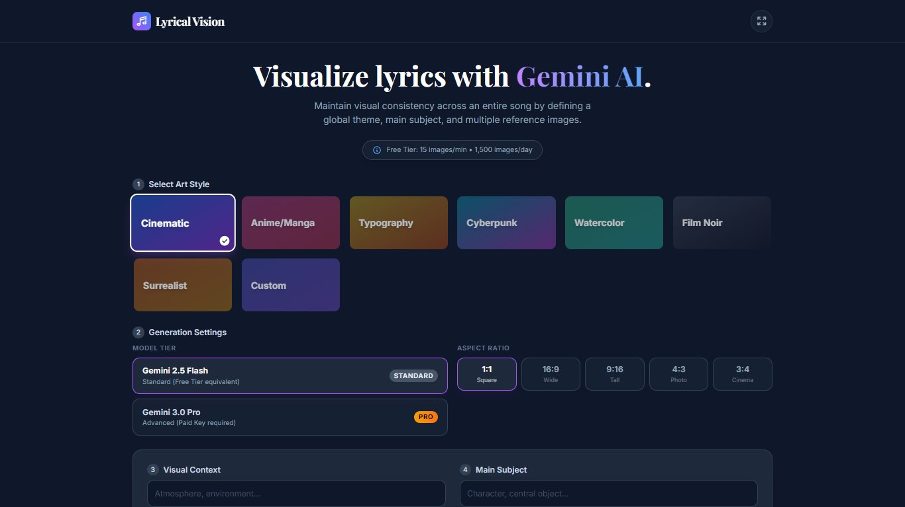

# Lyrical Vision 🎨🎵

Lyrical Vision is a world-class AI-powered application designed to transform song lyrics into a coherent series of visual artworks. By leveraging the **Gemini 2.5 Flash** and **3.0 Pro** models, the app ensures visual continuity across stanzas through advanced prompt engineering and multimodal references.

## 🖼️ Application Preview

> [!TIP]
> **The images below are placeholders.** Because the "Save to GitHub" feature only exports code, you must manually upload your own screenshots to this repository to replace them.

| Application Workspace | Resulting Storyboard |
| :---: | :---: |
|  |  |

## 🚀 Key Features

- **Stanza-by-Stanza Visualization**: Automatically parses lyrics into individual scenes.
- **Visual Continuity Engine**: Define a global theme and main subject for the whole song.
- **Multi-Image Reference**: Upload up to 3 images to guide character and style consistency.
- **Markdown Export**: Generate a full report of your visuals and lyrics for documentation.

## 🛠️ How to Fix "Broken" Images on GitHub

The "Save to GitHub" button in Google AI Studio only captures your code. It does **not** upload your local image files. To show your real screenshots here:

1.  **Run the app** and take two screenshots of your work.
2.  **Rename them** to `screenshot1.jpg` and `screenshot2.jpg`.
3.  **Go to your GitHub Repository** in your browser.
4.  **Click 'Add file' > 'Upload files'**.
5.  **Drag and drop** your two `.jpg` files into the box.
6.  **Commit the changes**.
7.  **Update this README**: Edit the image links in the table above to use `./screenshot1.jpg` and `./screenshot2.jpg` instead of the placeholder URLs.

## 📝 Technical Setup

- **AI Engine**: `@google/genai` (Gemini API)
- **Framework**: React 19 + Tailwind CSS
- **Model Support**: Gemini 2.5 Flash & Gemini 3.0 Pro

---

*Built with ❤️ using Gemini AI.*
