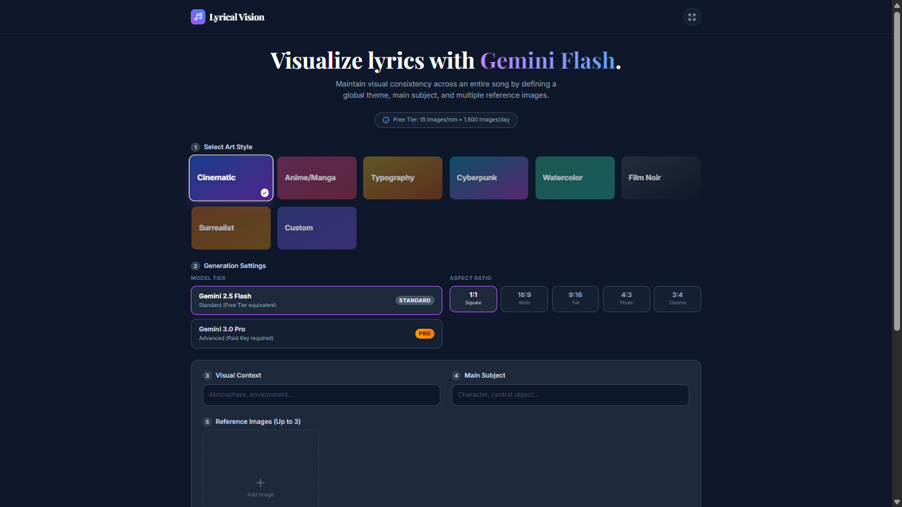

# Lyrical Vision 🎨🎵

Lyrical Vision is a world-class AI-powered application designed to transform song lyrics into a coherent series of visual artworks. By leveraging the **Gemini 2.5 Flash** and **3.0 Pro** models, the app ensures visual continuity across stanzas through advanced prompt engineering and multimodal references.

## 🖼️ Application Screenshots

| Editor View | Visualization View |
| :---: | :---: |
|  |  |

## ✨ Key Features

- **Stanza-by-Stanza Visualization**: Input your song lyrics, and the app automatically parses them into individual stanzas for generation.
- **Visual Continuity Engine**: 
  - **Global Theme**: Define the atmosphere and environment for the entire song.
  - **Main Subject**: Pin a character or object to remain consistent throughout the visual story.
- **Multi-Image Reference**: Upload up to **3 reference images** (multimodal input) to guide the AI's understanding of specific characters, artistic styles, or color palettes.
- **Curated Art Styles**: Choose from a variety of presets including Cinematic, Anime, Cyberpunk, Watercolor, and Surrealist, or define your own custom style.
- **Wide Format Support**: Optimized for wide aspect ratios (16:9, 4:3) with a responsive `6xl` layout that showcases high-resolution generations beautifully.
- **Pro Model Integration**: Toggle between Gemini 2.5 Flash (Standard) and Gemini 3.0 Pro (High Fidelity) for professional-grade results.

## 🚀 Getting Started

1. **Input Lyrics**: Paste your favorite song lyrics into the text area.
2. **Define Style**: Select one of the artistic presets.
3. **Set Continuity**: Enter a "Global Theme" and "Main Subject" to ensure your story looks consistent.
4. **Reference Images**: Upload photos or concept art to steer the visual direction.
5. **Generate**: Hit "Start Visualizing" to create your storyboard.

## 🛠️ Technical Details

- **Framework**: React 19 (ES6 Modules)
- **Styling**: Tailwind CSS
- **AI Engine**: @google/genai (Gemini API)
- **State Management**: React Hooks & UUID for unique stanza tracking

---

*Built with ❤️ using Gemini AI.*